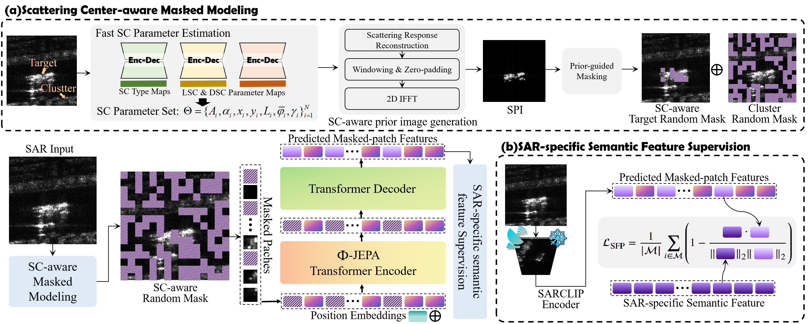

# &phi;-JEPA: Where and What to Reconstruct in Physics-Informed Radar Pre-training?

**Xin Zhang**, **Jiawei Pi**, **Yanhua Wang**, **Liang Zhang**, and **Yang Li**

Radar Technology Research Institute, Beijing Institute of Technology  
Zhengzhou Research Institute, Beijing Institute of Technology  
Henan Provincial Center for Integrated Innovation in Advanced Radar Intelligent Sensing

## News

- **2026-08-03:** Pre‑training weights are publicly available on  [Hugging Face](https://huggingface.co/kiki-orb/phi-JEPA)  and [Baidu Netdisk](https://pan.baidu.com/s/1cCKYp2QWqVvw6hKTd243iA?pwd=7bcf).
- Training code and downstream evaluation code will be released in a future update.

## Overview

Synthetic aperture radar (SAR) image pre-training aims to learn transferable representations from unlabeled SAR data. Existing masked modeling methods commonly rely on random masking and low-level reconstruction targets, which may overlook sparse, target-related scattering responses and overfit speckle fluctuations or background clutter.

We propose **&phi;-JEPA**, a physics-informed masked autoencoder for self-supervised SAR image pre-training. The method introduces:

1. **Scattering-Center-Aware Masked Modeling (SCM):** attributed scattering centers are used to reconstruct a physical scattering prior, which guides masking toward informative target regions while preserving sufficient visible context.
2. **SAR-Specific Semantic Feature Prediction (SFP):** a frozen SARCLIP ViT-B/16 image encoder supplies patch-level semantic targets, replacing low-level pixel or handcrafted-feature reconstruction with semantic representation prediction.

Together, SCM and SFP encourage the encoder to learn physically meaningful and transferable SAR representations for few-shot target recognition.

## Framework

  
</p

The framework first estimates attributed scattering centers and reconstructs a scattering-prior image for target-aware masking. A ViT-B encoder processes the masked SAR image, while a lightweight Transformer decoder predicts SARCLIP patch features at masked positions using a cosine feature-alignment objective.

## Pretrained Weights

The pretrained checkpoint used in our main experiments is available below.

| Method | Backbone | Input channel | Hugging Face | Baidu Netdisk |
|---|---|---:|---|---:|---|---|
| MAE | ViT-B/16 | 1 | [Download](https://huggingface.co/kiki-orb/phi-JEPA/blob/main/weights/mae_vitb16_e100.pth) | [Download](https://pan.baidu.com/s/16bmUiEU5QG4bpAseSocIuA?pwd=26i1) |
| FG-MAE | ViT-B/16 | 1 | [Download](https://huggingface.co/kiki-orb/phi-JEPA/blob/main/weights/fgmae_vitb16_e100.pth) | [Download](https://pan.baidu.com/s/1xxtD7CMZ8pzhwkwUlBFxfg?pwd=wp6q) |
| I-JEPA | ViT-B/16 | 3 | [Download](https://huggingface.co/kiki-orb/phi-JEPA/blob/main/weights/ijepa_vitb16_e100.pth.tar) | [Download](https://pan.baidu.com/s/1zJl27VDB8i4MCAG1Gm1Ujg?pwd=rc8h) |
| LoMaR | ViT-B/16 | 1 | [Download](https://huggingface.co/kiki-orb/phi-JEPA/blob/main/weights/lomar_vitb16_e100.pth) | [Download](https://pan.baidu.com/s/11kHDWPxuLsZZuBNUyofc5g?pwd=kgjb) |
| SAR-JEPA | ViT-B/16 | 1 | [Download](https://huggingface.co/kiki-orb/phi-JEPA/blob/main/weights/sarjepa_vitb16_e100.pth) | [Download](https://pan.baidu.com/s/1NzEvcdas3t1zUtCMlP5Ouw?pwd=baux) |
| &phi;-JEPA | ViT-B/16 | 3 | [Download](https://huggingface.co/kiki-orb/phi-JEPA/blob/main/weights/phi_jepa_vitb16_.pth) | [Download](https://pan.baidu.com/s/1Dp2mOHR-fSmJZ3Et-lAsHQ?pwd=cap4) |
